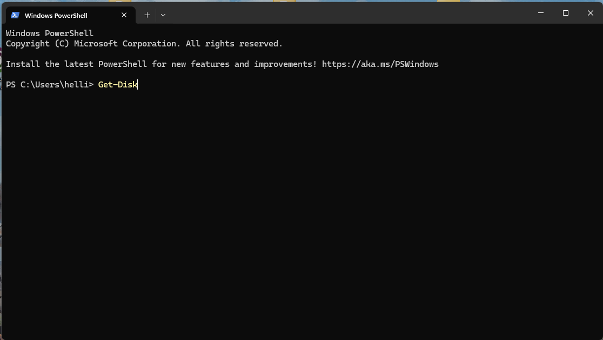
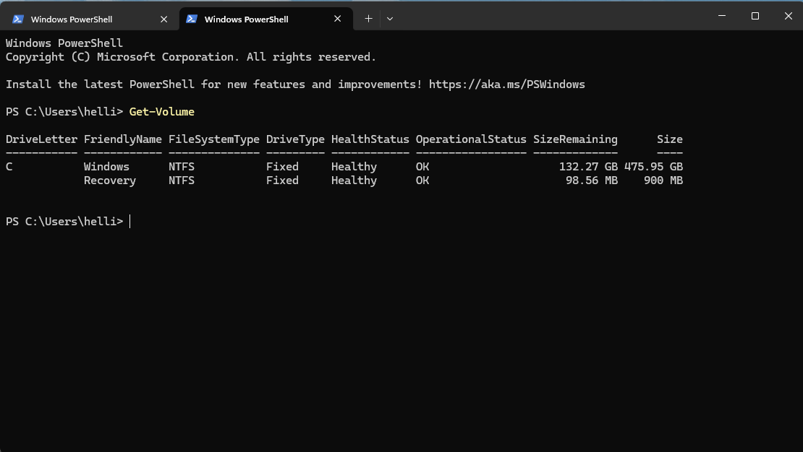

# IT Support PowerShell Disk Management Walkthrough

## Project Summary
*In this project, I demonstrate a basic IT support workflow using PowerShell to safely inspect disk and volume information on a Windows system.
The goal is to simulate a real-world troubleshooting scenario in which system information is gathered using read-only commands, ensuring no configuration changes are made.*

### Languages Used
- PowerShell

### Environment
- Windows 10

### Tools and Technologies
- PowerShell
- Windows Disk Management utilities

---

## Demonstration
*I used PowerShell to inspect disk and volume information on a Windows system.*
*The Get-Disk command was used to display all connected disks and their current status.*
*The Get-Volume command was then used to identify drive letters, file system types, and available storage.*

*These read-only commands reflect common IT support diagnostic practices used to gather system information without modifying configurations.*

---

## Media

### Disk Information

### Volume Information

---

## Actions and Observations

- I used **`Get-Disk`** to verify that all system disks were online.

- I ran **`Get-Volume`** to review available storage and file system details.

- *All commands were read-only, and no disk configuration changes were made.*

---

## Lessons Learned
*This project reinforced the importance of using read-only PowerShell commands during system diagnostics and demonstrated how command-line tools support safe troubleshooting in IT environments.
Understanding the impact of each command is critical, as improper inputs can lead to unintended system changes.*
